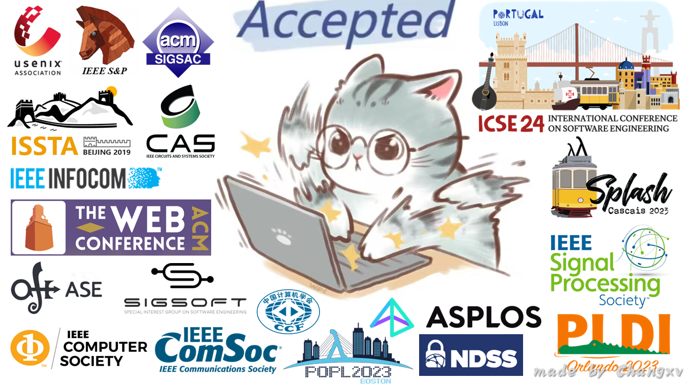

# Github Issue Blog 

My personal blog using issues and GitHub Actions.

  
  <i>猫猫来自 <a href="https://weibo.com/u/2169547965">@魏大葱有木瓜</a></i>

 

## About me
本科 *中南大学* 在读。

<h2><a href="https://github.com/changxvv/Blog/issues/1"> 友情链接 </a></h2>

<table>
<thead>
<tr>
<th>Name</th>
<th>Link</th>
<th>Desc</th>
</tr>
</thead>
<tbody>
<tr>
<td>$\textbf{H{\color{red}olyk}}$</td>
<td>https://blog.asukakyle.top/</td>
<td>好兄弟、本科室友、World Final 爷</td>
</tr>
<tr>
<td>千年八云紫</td>
<td>https://reimu.red/</td>
<td>好兄弟、Geek、啥都会</td>
</tr>
</tbody>
</table>

## 置顶文章
- [格式规范](https://github.com/changxvv/Blog/issues/3) 
## 最近更新
- [我的学习体系](https://github.com/changxvv/Blog/issues/4) 
- [格式规范](https://github.com/changxvv/Blog/issues/3) 
- [友情链接](https://github.com/changxvv/Blog/issues/1) 
- [关于我](https://github.com/changxvv/Blog/issues/2) 
## Tips
- [我的学习体系](https://github.com/changxvv/Blog/issues/4) 
## TODO

TODO list from [我的学习体系](https://github.com/changxvv/Blog/issues/4) all done.

